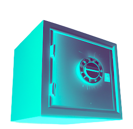

## `vault`

The Vault contract is a simple smart contract that allows users to lock a predefined CW20 token into the contract. To use the contract, users simply send a message with the desired amount of the token to be locked. Once the tokens are locked, they can be unlocked at any time by sending an unlock message to the contract. However, the unlocked tokens are not yet liquid and must be confirmed by the user after a specified time period.