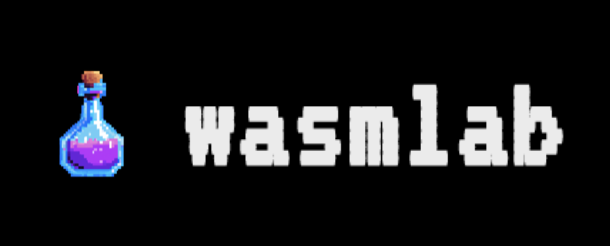

**Some personal experimentations with CosmWasm smart contract development and front end for CosmWasm application**

## Test front-end

To test front-end, the following dependencies are necessary:
- Docker
- Juno binary `junod` https://github.com/CosmosContracts/juno
- Python3

### Clone dependencies

(Root directory for dependencies can be changed in `scripts/contracts.yaml`)

```
cd ~/Desktop
git clone https://github.com/lubtd/wasmlab.git
git clone https://github.com/lubtd/dao-contracts.git
git clone https://github.com/CosmWasm/cw-plus.git
git clone https://github.com/astroport-fi/astroport-core.git
```

### Prepare Juno testnet

```
docker run -it \
  --name juno_node_1 \
  -p 1317:1317 \
  -p 26656:26656 \
  -p 26657:26657 \
  -e STAKE_TOKEN=ujunox \
  -e UNSAFE_CORS=true \
  ghcr.io/cosmoscontracts/juno:v11.0.0 \
  ./setup_and_run.sh juno16g2rahf5846rxzp3fwlswy08fz8ccuwk03k57y

echo "siren window salt bullet cream letter huge satoshi fade shiver permit offer happy immense wage fitness goose usual aim hammer clap about super trend" > mnemonic.txt

junod keys add user1 --recover < mnemonic.txt
```

### Deploy contracts

```
cd wasmlab/scripts
python3 build.py
python3 deploy.py
python3 instantiate.py tokens
python3 instantiate.py dao
python3 instantiate.py factory
python3 instantiate.py pair
```

### Serve front-end

```
cd ../frontend
yarn dev

```
